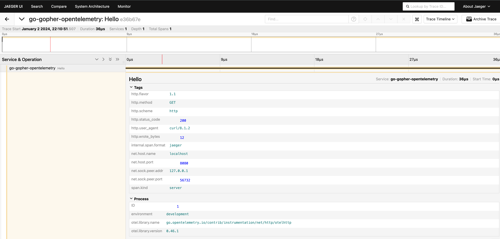

# learn-go-by-example use OpenTelemetry Go library to create an instrumented application and send traces to a Jaeger instance -:(

- docker run -d --name jaeger \
  -e COLLECTOR_ZIPKIN_HTTP_PORT=9411 \
  -p 5775:5775/udp \
  -p 6831:6831/udp \
  -p 6832:6832/udp \
  -p 5778:5778 \
  -p 16686:16686 \
  -p 14268:14268 \
  -p 9411:9411 \
  jaegertracing/all-in-one

- export MY_NAME=smy; go run main.go
- curl localhost:8080
- http://localhost:16686/
